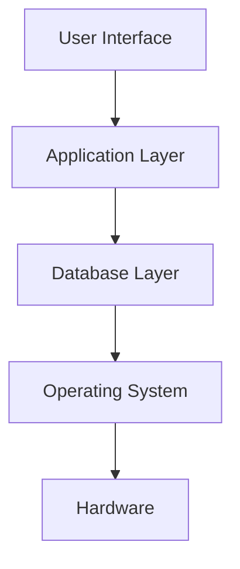
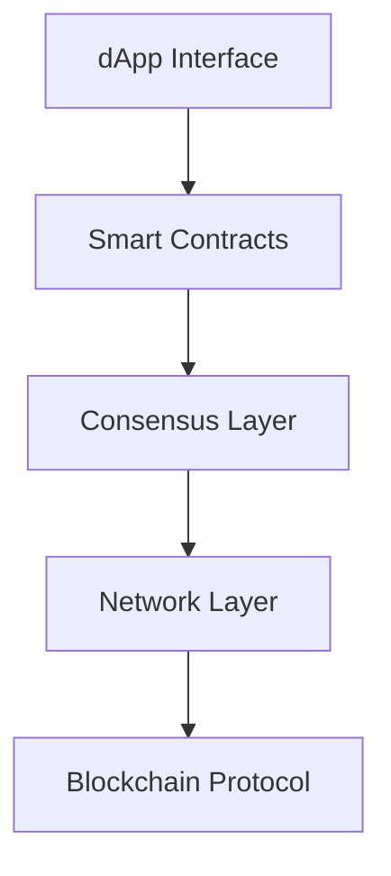
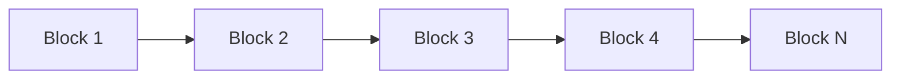

import Tabs from '@theme/Tabs';
import TabItem from '@theme/TabItem';
import Admonition from '@theme/Admonition';

# Introduction to Blockchains

Welcome to the **Blockchain Summer School**! In this lecture, we'll explore the fundamental concepts that make blockchain technology revolutionary.

## 🎯 Learning Objectives

By the end of this lecture, you will be able to:

- Understand what blockchain technology is and why it matters
- Explain the difference between centralized and decentralized systems
- Identify the key components of a blockchain
- Recognize real-world applications of blockchain technology

## 🏗️ The Software Stack Evolution

### Traditional Software Architecture

In traditional software systems, we have a clear hierarchy:



### Blockchain Software Stack

Blockchain introduces a new paradigm:



## 🔄 Centralized vs Decentralized Systems

### Centralized Systems

<Admonition type="info" title="Definition">
A **centralized system** has a single point of control and failure.
</Admonition>

**Examples:**
- Traditional banks
- Social media platforms
- Government databases

**Characteristics:**
- ✅ Fast and efficient
- ✅ Easy to maintain
- ❌ Single point of failure
- ❌ Requires trust in central authority

### Decentralized Systems

<Admonition type="info" title="Definition">
A **decentralized system** distributes control across multiple participants.
</Admonition>

**Examples:**
- Bitcoin network
- Ethereum ecosystem
- IPFS (InterPlanetary File System)

**Characteristics:**
- ✅ No single point of failure
- ✅ Trustless operation
- ❌ Slower than centralized systems
- ❌ More complex to coordinate

## 🧱 What is a Blockchain?

A blockchain is a **distributed, immutable ledger** that records transactions across a network of computers.

### Key Components

<Tabs>
<TabItem value="blocks" label="Blocks" default>

Each block contains:
- **Header**: Metadata about the block
- **Transactions**: List of validated transactions
- **Hash**: Unique identifier linking to previous block

```javascript
// Example block structure
const block = {
  header: {
    version: "1.0",
    previousHash: "0x123...abc",
    timestamp: 1640995200,
    nonce: 12345
  },
  transactions: [
    { from: "Alice", to: "Bob", amount: 100 },
    { from: "Bob", to: "Charlie", amount: 50 }
  ],
  hash: "0x456...def"
};
```

</TabItem>
<TabItem value="chain" label="Chain">

Blocks are linked together in a **chain**:



Each block references the previous block's hash, creating an immutable chain.

</TabItem>
<TabItem value="consensus" label="Consensus">

**Consensus mechanisms** ensure all participants agree on the state:

- **Proof of Work (PoW)**: Bitcoin, early Ethereum
- **Proof of Stake (PoS)**: Ethereum 2.0, Cardano
- **Delegated Proof of Stake (DPoS)**: EOS, Tron

</TabItem>
</Tabs>

## 🌍 Real-World Applications

### Financial Services

<Admonition type="success" title="DeFi Revolution">
Decentralized Finance (DeFi) is disrupting traditional banking with permissionless financial services.
</Admonition>

- **Lending & Borrowing**: Aave, Compound
- **Decentralized Exchanges**: Uniswap, SushiSwap
- **Stablecoins**: USDC, DAI

### Digital Identity

- **Self-Sovereign Identity**: Users control their own identity data
- **Verifiable Credentials**: Tamper-proof digital certificates
- **Privacy-Preserving Authentication**: Zero-knowledge proofs

### Supply Chain Management

- **Product Traceability**: Track goods from source to consumer
- **Counterfeit Prevention**: Immutable product records
- **Automated Compliance**: Smart contracts enforce regulations

## 🚀 The Evolution of Blockchains

### Blockchain Generations

<Tabs>
<TabItem value="gen1" label="Generation 1" default>

**Bitcoin (2009)**
- Digital currency
- Proof of Work consensus
- Limited scripting capabilities

**Key Innovation**: Decentralized digital money

</TabItem>
<TabItem value="gen2" label="Generation 2">

**Ethereum (2015)**
- Smart contracts
- Turing-complete programming
- dApp platform

**Key Innovation**: Programmable blockchain

</TabItem>
<TabItem value="gen3" label="Generation 3">

**Modern Blockchains**
- Scalability solutions
- Cross-chain interoperability
- Advanced consensus mechanisms

**Key Innovation**: Enterprise-ready infrastructure

</TabItem>
</Tabs>

## 🔧 Technical Deep Dive

### Cryptographic Foundations

Blockchain relies on several cryptographic primitives:

```python
# Example: Creating a digital signature
from cryptography.hazmat.primitives import hashes
from cryptography.hazmat.primitives.asymmetric import rsa, padding

# Generate key pair
private_key = rsa.generate_private_key(
    public_exponent=65537,
    key_size=2048,
)
public_key = private_key.public_key()

# Sign a message
message = b"Hello, Blockchain!"
signature = private_key.sign(
    message,
    padding.PSS(
        mgf=padding.MGF1(hashes.SHA256()),
        salt_length=padding.PSS.MAX_LENGTH
    ),
    hashes.SHA256()
)
```

### Hash Functions

Hash functions are crucial for blockchain integrity:

```javascript
// Example: SHA-256 hashing
const crypto = require('crypto');

function createHash(data) {
  return crypto.createHash('sha256').update(data).digest('hex');
}

const blockData = "Block #123: Alice sends 100 BTC to Bob";
const hash = createHash(blockData);
console.log(hash); // Output: 64-character hex string
```

## 🎓 Interactive Exercise

Let's create a simple blockchain in JavaScript:

```javascript
const SHA256 = require('crypto-js/sha256');

class Block {
  constructor(timestamp, data, previousHash = '') {
    this.timestamp = timestamp;
    this.data = data;
    this.previousHash = previousHash;
    this.hash = this.calculateHash();
    this.nonce = 0;
  }

  calculateHash() {
    return SHA256(this.previousHash + this.timestamp + JSON.stringify(this.data) + this.nonce).toString();
  }

  mineBlock(difficulty) {
    while (this.hash.substring(0, difficulty) !== Array(difficulty + 1).join("0")) {
      this.nonce++;
      this.hash = this.calculateHash();
    }
    console.log("Block mined: " + this.hash);
  }
}

class Blockchain {
  constructor() {
    this.chain = [this.createGenesisBlock()];
    this.difficulty = 2;
  }

  createGenesisBlock() {
    return new Block("01/01/2025", "Genesis Block", "0");
  }

  getLatestBlock() {
    return this.chain[this.chain.length - 1];
  }

  addBlock(newBlock) {
    newBlock.previousHash = this.getLatestBlock().hash;
    newBlock.mineBlock(this.difficulty);
    this.chain.push(newBlock);
  }

  isChainValid() {
    for (let i = 1; i < this.chain.length; i++) {
      const currentBlock = this.chain[i];
      const previousBlock = this.chain[i - 1];

      if (currentBlock.hash !== currentBlock.calculateHash()) {
        return false;
      }

      if (currentBlock.previousHash !== previousBlock.hash) {
        return false;
      }
    }
    return true;
  }
}

// Usage example
let myCoin = new Blockchain();
console.log("Mining block 1...");
myCoin.addBlock(new Block("02/01/2025", { amount: 4 }));
console.log("Mining block 2...");
myCoin.addBlock(new Block("02/01/2025", { amount: 10 }));

console.log("Is blockchain valid? " + myCoin.isChainValid());
```

## 📚 Further Reading

- [Bitcoin Whitepaper](https://bitcoin.org/bitcoin.pdf) - Satoshi Nakamoto
- [Ethereum Whitepaper](https://ethereum.org/en/whitepaper/) - Vitalik Buterin
- [Mastering Bitcoin](https://github.com/bitcoinbook/bitcoinbook) - Andreas Antonopoulos

## 🎯 Summary

In this lecture, we've covered:

- ✅ The fundamental concepts of blockchain technology
- ✅ Differences between centralized and decentralized systems
- ✅ Key components of blockchain architecture
- ✅ Real-world applications and use cases
- ✅ The evolution of blockchain generations
- ✅ Basic cryptographic foundations

<Admonition type="tip" title="Next Steps">
In the next lecture, we'll dive deeper into **Smart Contracts and Virtual Machines**, where you'll learn how to program on the blockchain!
</Admonition>

---

**Ready for hands-on practice?** Check out the [lab exercises](../lab/content/) to start building your first blockchain application! 